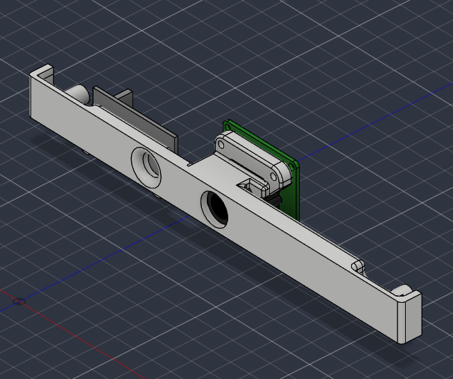
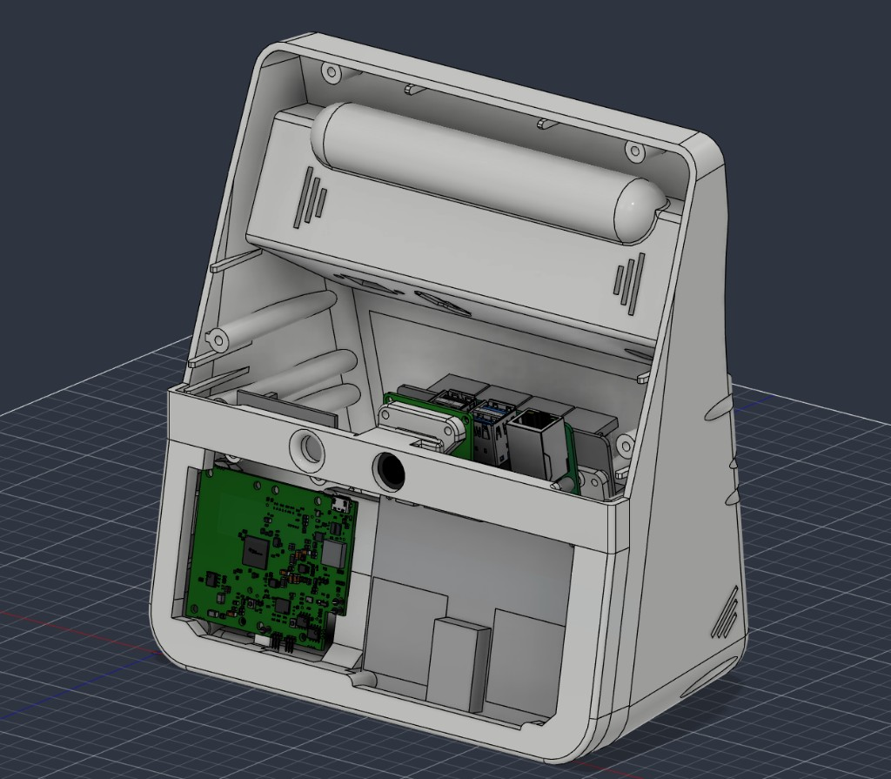

# Camera front

Thin strip that sits on the radar front, under the screen. Pick **camera only** or **camera + sound detector**.

| Variant | STL | Use when |
| --- | --- | --- |
| Camera | [`Front-Camera.stl`](../../stls/camera/Front-Camera.stl) | Camera only |
| Camera + sound detector | [`Front-Camera-Sound-Detector.stl`](../../stls/camera/Front-Camera-Sound-Detector.stl) | Camera plus microphone / sound module |

## Hardware

Camera module in the CAD: Innomaker OV9281. Full table: [Required hardware](../hardware.md).

| Variant | M3 inserts | M2 inserts |
| --- | --- | --- |
| Camera | 2 — case mounting | 2 — OV9281 |
| Camera + sound detector | 2 — case mounting, plus 2 for the sound detector (4 M3 total) | 2 — OV9281 |

## Print notes

Print with the **face on the build plate**. **Tree supports required.**

