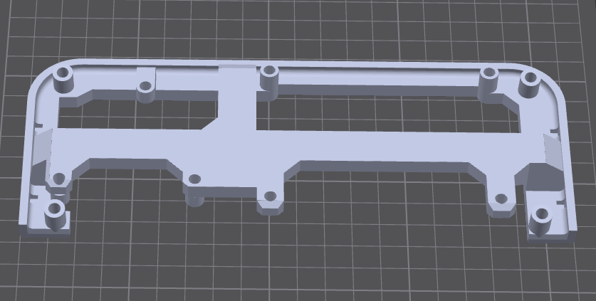
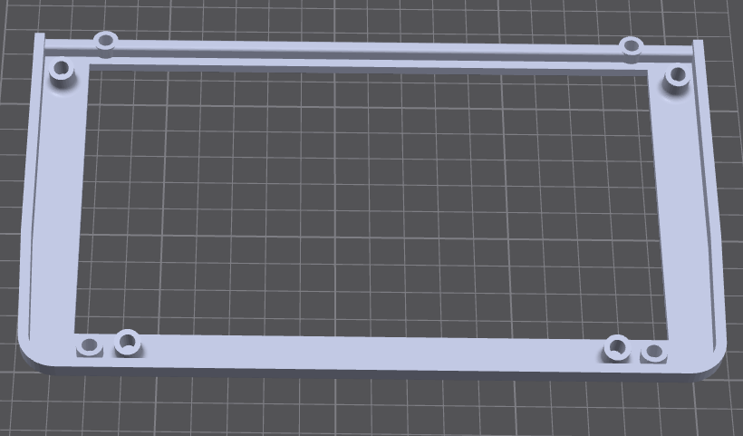
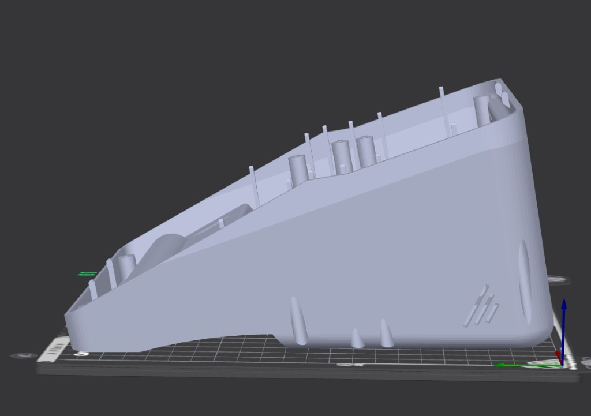

# Printing

Minimum print bed: **220 × 220 mm**. See the [project README](../../../README.md#printer) for example printers.

## Files

Print only the STLs from your [variant list](choosing-a-variant.md). Do not mix a DC-jack shell with a USB-C/Ethernet board cutout, or a screen bezel that does not match the panel.

CAD source for checking orientation: [`../step/Open-Flight-Monitor-3.step`](../step/Open-Flight-Monitor-3.step)

## Suggested starting point

Fill in after a known-good print. These are placeholders, not validated profiles.

| Setting | Suggestion | Notes |
| --- | --- | --- |
| Material | PETG or ABS/ASA | TODO: confirm preferred filament |
| Layer height | 0.2 mm | |
| Nozzle | 0.4 mm | |
| Walls | 3–4 | |
| Infill | 15–20% | |
| Supports | Tree where noted below | Shell, camera, and no-fill radar |
| Bed | **220 × 220 mm** minimum | |

## Orientation

**Fronts (radar, camera, screen):** cosmetic face on the build plate.

**Shell:** flat on its back (rear of the enclosure on the bed). Needs supports; **tree supports recommended**.

Radar: face to the plate. **Tree supports required for the no-fill version** (open in front of the radars; this is not a slicer infill setting).

Screen: face to the plate.

Camera: face to the plate. **Tree supports required.**

Shell: printed on its back. **Supports required; tree recommended.**

## Per-part exceptions

- **Radar no-fill** — no cover in front of the radars (RF). Tree supports. See [radar](parts/radar.md).
- **Insert bosses** — pause is not required; press inserts after printing.

## Fit

If holes are tight, note slicer XY compensation or drill sizes on the relevant part page rather than scaling the whole model.
