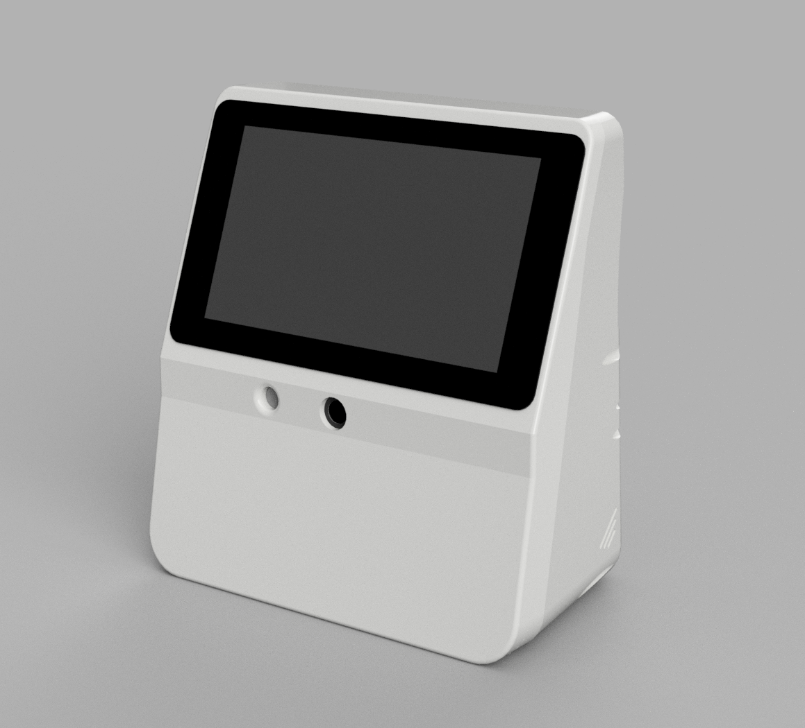
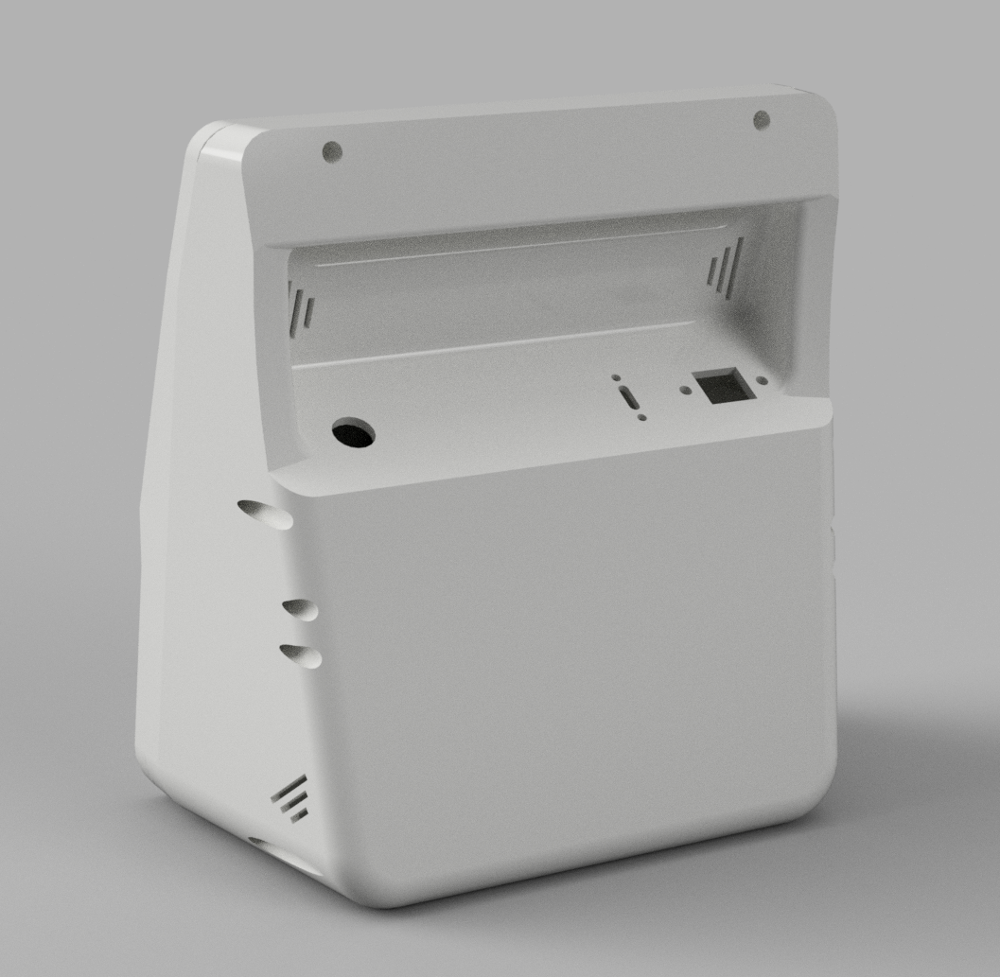

# OpenFlight enclosure

3D-printable enclosure for an OpenFlight monitor. Print a shell, radar front, camera front, screen, and feet, then assemble.

Print STLs from each part’s `v1/` folder. `experimental/` is for in-progress parts.

## Documentation

| Page | What it covers |
| --- | --- |
| [Choosing a variant](docs/choosing-a-variant.md) | Decision tree and print list |
| [Printing](docs/printing.md) | Orientation, materials, settings |
| [Required hardware](docs/hardware.md) | Heat-set inserts and screws per part |
| [Shell and power](docs/parts/shell.md) | DC jack vs USB-C/Ethernet, X12 boards |
| [Pi adapters](docs/parts/adapters.md) | No-UPS (x1202) and x1209 (x12-a1 shell) |
| [Feet](docs/parts/feet.md) | Solid vs adjustable |
| [Screen bezel](docs/parts/screen.md) | Display size options |
| [Camera front](docs/parts/camera.md) | Camera, sound-detector + retainer; UART / USB OPS |
| [Radar front](docs/parts/radar.md) | Standard or no-fill (open in front of the radars) |
| [CAD drawings](docs/drawings/README.md) | Assembly and print-orientation stills |

CAD source: [`step/Open-Flight-Monitor-3.step`](step/Open-Flight-Monitor-3.step). Component STEP files: [`reference-models/`](reference-models/).

## Printer

Minimum bed: **220 × 220 mm**. The shell is the largest part.

Printers that meet that (and common larger beds):

| Printer | Bed |
| --- | --- |
| Creality Ender 3 / Ender 3 V2 / Ender 3 V3 SE / Ender 3 S1 | 220 × 220 mm |
| Creality K1 | 220 × 220 mm |
| Sovol SV06 | 220 × 220 mm |
| Anycubic Kobra 2 | 220 × 220 mm |
| Elegoo Neptune 3 / Neptune 4 | 225 × 225 mm |
| Bambu Lab A1, P1S, X1C | 256 × 256 mm |

The Bambu A1 mini (180 × 180 mm) is too small. Prusa MK3S+ / MK4 are 250 × 210 mm — the 210 mm axis is under the minimum.

## Quick start

1. Choose **power I/O**, **UPS/HAT**, **screen**, **front panel**, and **feet**.
2. Copy the STL paths from [Choosing a variant](docs/choosing-a-variant.md).
3. Print using [Printing](docs/printing.md).
4. Assemble using [Assembly](docs/assembly.md).

## License

[GNU GPL v3](LICENSE)
