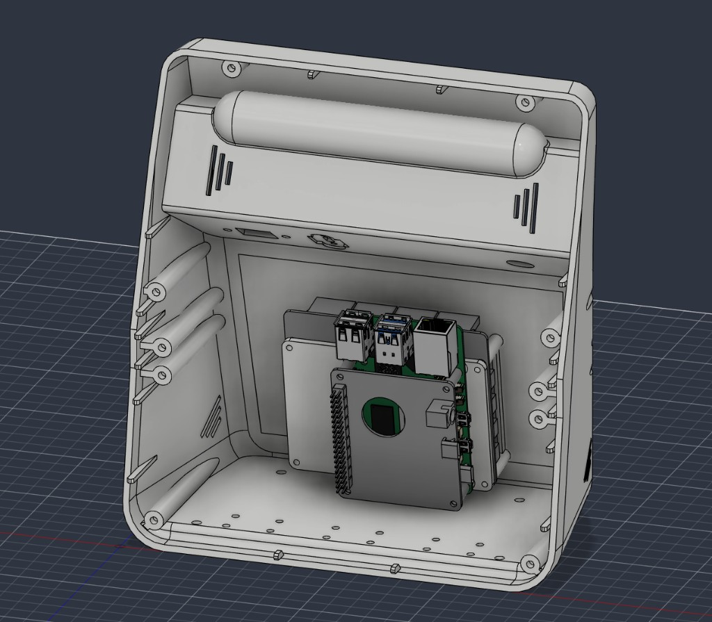
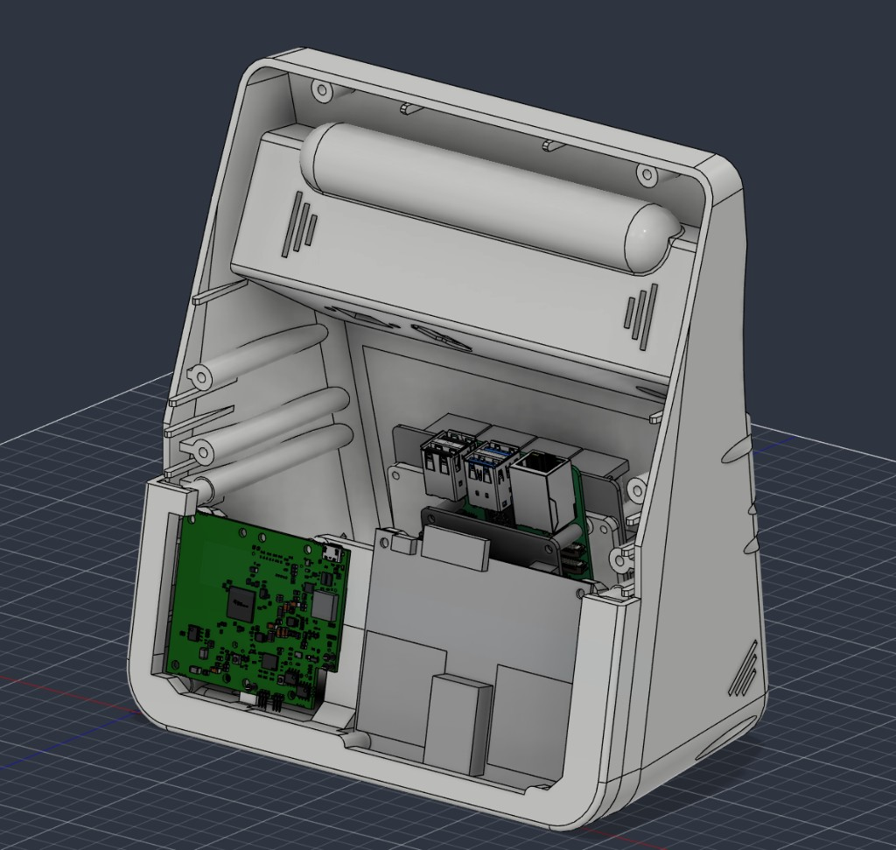

# Choosing a variant

The enclosure is modular. You print **one rear shell**, **one screen bezel**, **one radar front**, **one camera front**, **one set of feet**, and an adapter when you skip the UPS or when the board requires it.

All STL paths below are relative to [`stls/`](../stls/). Print from **`v1/`**. Files under `experimental/` are not the release set. Current shells have **Ethernet, a DC jack, and a power button**. Old USB-C rear shells are **end of life** (`shell/eol/`) — they do not meet the USB-C specification.

## Decision tree

```
1. Board / UPS (shell filename must match; files in shell/v1/)
   ├─ x1202 UPS          → Shell-x1202
   ├─ no UPS             → still Shell-x1202 + adapters/v1/x1202 Pi Adapater.stl
   ├─ x1206              → Shell-x1206
   └─ x1209              → Shell-x12-a1 + adapters/v1/x1209 PI Adapater.stl
                           (do not use the x12-a1 shell on its own)

2. Screen
   ├─ 800×480
   ├─ 1024×600
   ├─ Raspberry Pi Display
   └─ Raspberry Pi Display 2

3. Radar front
   ├─ Standard (cover in front of the radars)
   └─ No-fill (open in front of the radars; does not block RF)

4. Camera front (same strip for UART or USB OPS)
   ├─ Camera only
   └─ Camera + sound detector  (+ print Sound-Detector-Retainer.stl)

5. Feet
   ├─ Solid
   └─ Adjustable
```

## Print list (copy and fill)

| Slot | Your pick | STL |
| --- | --- | --- |
| Shell | Board / UPS | `shell/v1/Shell-<board>.stl` |
| Adapter | none / no-UPS / x1209 | `adapters/v1/x1202 Pi Adapater.stl` if skipping UPS; `adapters/v1/x1209 PI Adapater.stl` with the x12-a1 shell |
| Screen | | `screen/v1/Screen-….stl` |
| Radar | | `radar/v1/Front-Radar….stl` |
| Camera | | `camera/v1/Front-Camera….stl` (+ `camera/v1/Sound-Detector-Retainer.stl` if using sound) |
| Feet | Solid / Adjustable | `feet/v1/Feet-….stl` |

## Compatibility matrix

### Shell × board

| Board | Current shell | Extra adapter |
| --- | --- | --- |
| x1202 (UPS) | `shell/v1/Shell-x1202.stl` | — |
| no UPS | same x1202 shell | `adapters/v1/x1202 Pi Adapater.stl` (recommended) |
| x1206 | `shell/v1/Shell-x1206.stl` | — |
| x1209 | `shell/v1/Shell-x12-a1.stl` | `adapters/v1/x1209 PI Adapater.stl` (required) |

USB-C / Ethernet STLs (`shell/eol/usbc-ethernet/`) are withdrawn. Do not print them for a new unit.

Do not print `Shell-x12-a1` without the x1209 adapter. That shell is only for x1209.

### Screen (independent of shell)

| Variant | STL |
| --- | --- |
| 800×480 | `screen/v1/Screen-800x480.stl` |
| 1024×600 | `screen/v1/Screen-1024x600.stl` |
| Raspberry Pi Display | `screen/v1/Screen-RPI-Display.stl` |
| Raspberry Pi Display 2 | `screen/v1/Screen-RPI-Display-2.stl` |

### Radar front

| Variant | STL |
| --- | --- |
| Radar | `radar/v1/Front-Radar.stl` |
| Radar, no-fill (no cover in front of the radars) | `radar/v1/Front-Radar-No-Fill.stl` |

### Camera front

UART vs USB OPS does not change the camera STL. The strip clears both.

| Variant | STL |
| --- | --- |
| Camera | `camera/v1/Front-Camera.stl` |
| Camera + sound detector | `camera/v1/Front-Camera-Sound-Detector.stl` **and** `camera/v1/Sound-Detector-Retainer.stl` |

### Feet (independent)

| Variant | STL |
| --- | --- |
| Solid | `feet/v1/Feet-Solid.stl` |
| Adjustable | `feet/v1/Feet-Adjustable.stl` |

## Worked examples

**Typical DC-powered unit**

- `shell/v1/Shell-x1206.stl`
- `radar/v1/Front-Radar.stl`
- `camera/v1/Front-Camera.stl`
- `screen/v1/Screen-800x480.stl`
- `feet/v1/Feet-Solid.stl`

**x1202 UPS, 1024×600, sound detector, adjustable feet**

- `shell/v1/Shell-x1202.stl`
- `radar/v1/Front-Radar.stl`
- `camera/v1/Front-Camera-Sound-Detector.stl`
- `camera/v1/Sound-Detector-Retainer.stl`
- `screen/v1/Screen-1024x600.stl`
- `feet/v1/Feet-Adjustable.stl`

**Same layout with no UPS** — still print `Shell-x1202`, plus `adapters/v1/x1202 Pi Adapater.stl` so the Pi mounts without the UPS board.

Hardware for whichever list you print: [Required hardware](hardware.md).

## CAD overview

Close-up order is radar, then camera, then screen. See [Assembly](assembly.md) for the CAD stills.





If you like the design, [buy me a coffee](https://buymeacoffee.com/cormacmcgrath).
