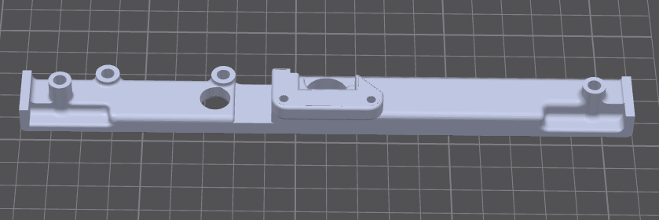

# Camera front

Thin strip that sits on the radar front, under the screen. The current front is **camera + sound detector**. Print both STLs.

The strip is relieved behind the middle so **UART and USB OPS** both fit on the radar front. You do not print a different camera STL for OPS connector type.

| File | Role |
| --- | --- |
| [`Front-Camera-Sound-Detector.stl`](../../stls/camera/v1/Front-Camera-Sound-Detector.stl) | Camera strip with sound-detector pocket |
| [`Sound-Detector-Retainer.stl`](../../stls/camera/v1/Sound-Detector-Retainer.stl) | Holds the sound board in the pocket |

The camera-only front (`Front-Camera.stl`) is **EOL** — see [`stls/camera/eol/`](../../stls/camera/eol/README.md).

## Hardware

Camera module in the CAD: Innomaker OV9281. Full table: [Required hardware](../hardware.md).

| Inserts | Role |
| --- | --- |
| 2× M3 | Case mounting |
| 2× M2 | OV9281 |
| 2× M2 | Sound-detector retainer |

Seat the sound board in the pocket, then screw the retainer over it into the two extra M2 inserts.

## Print notes

Print the camera strip with the **face on the build plate**. **Tree supports required.**

Print the retainer **flat** (the 2.5 mm plate on the bed). No supports.

