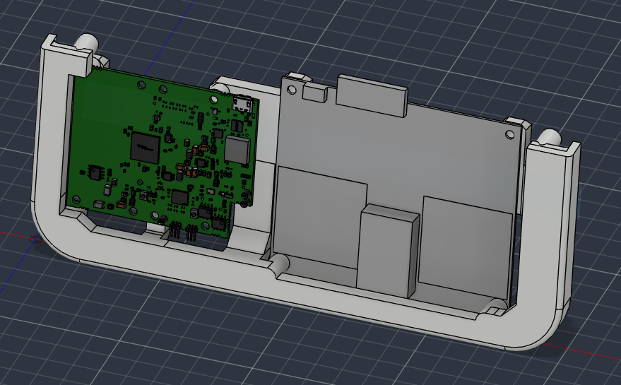
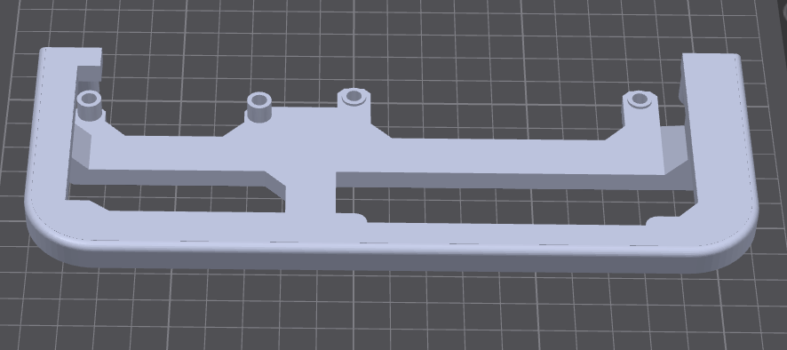

# Radar front

Lower housing for OPS and IWR. Print this **and** a [camera front](camera.md). UART and USB OPS both use this radar front; the [camera strip](camera.md) is the part that clears both connector types.

The current front is **no-fill** — no cover in front of the radars, so the plastic does not affect RF. You can flash the IWR after the module is mounted.

| File | Role |
| --- | --- |
| [`Front-Radar-No-Fill.stl`](../../stls/radar/v1/Front-Radar-No-Fill.stl) | Current — open in front of the radars |

The filled front (`Front-Radar.stl`) is **EOL** — see [`stls/radar/eol/`](../../stls/radar/eol/README.md). That cover blocked RF and IWR access after mounting.

## Hardware

See [Required hardware](../hardware.md).

**12× M3 inserts:** 4 OPS, 4 IWR, 4 case mounting.

**IWR:** on the current no-fill front you can flash after it is mounted. See [Assembly](../assembly.md).

## Print notes

No-fill is **not** a slicer infill setting. It means there is no wall covering the radar faces.

Print **on its back**. **Tree supports required.**

