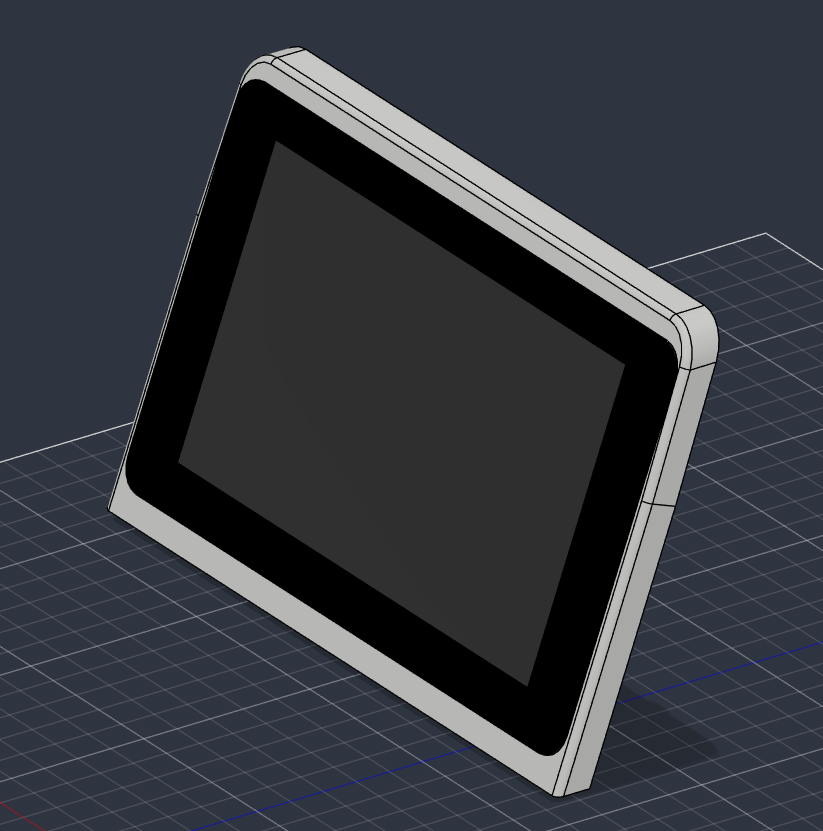
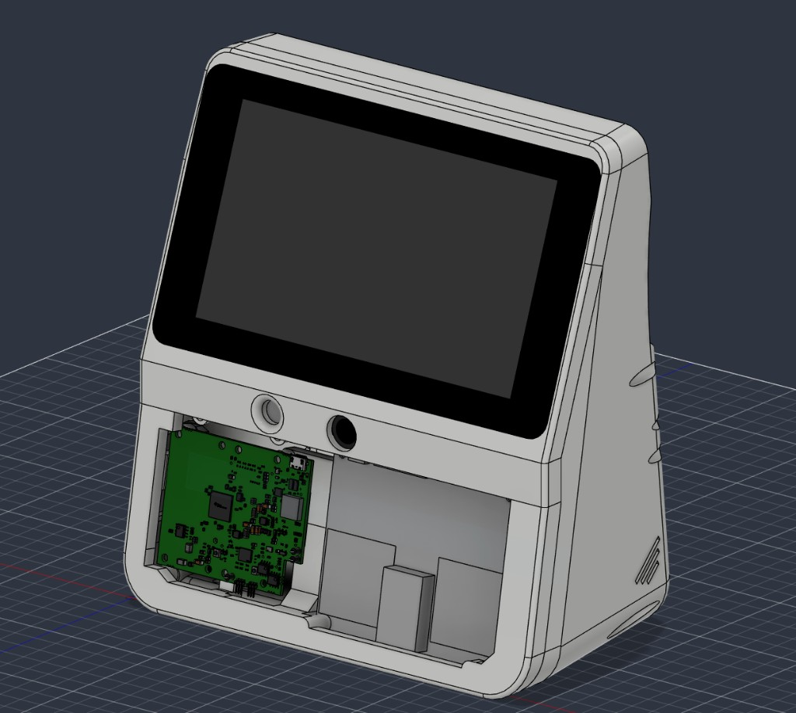

# Screen bezel

Pick **one** bezel that matches the panel. The rest of the enclosure does not change.

| Variant | STL | Typical panel |
| --- | --- | --- |
| 800×480 | [`Screen-800x480.stl`](../../stls/screen/v1/Screen-800x480.stl) | TODO: vendor / size (inch) |
| 1024×600 | [`Screen-1024x600.stl`](../../stls/screen/v1/Screen-1024x600.stl) | TODO |
| Raspberry Pi Display | [`Screen-RPI-Display.stl`](../../stls/screen/v1/Screen-RPI-Display.stl) | Official 7" DSI (v1) — confirm |
| Raspberry Pi Display 2 | [`Screen-RPI-Display-2.stl`](../../stls/screen/v1/Screen-RPI-Display-2.stl) | Official Display 2 — confirm |

## Hardware

See [Required hardware](../hardware.md).

| Variant | M3 inserts |
| --- | --- |
| 800×480 | 4 — case mounting |
| Raspberry Pi Display | 4 — case mounting |
| Raspberry Pi Display 2 | 4 — case mounting |
| 1024×600 | 4 — case mounting, plus 4 for the panel (8 total) |

## Print notes

Print with the **face on the build plate**.

